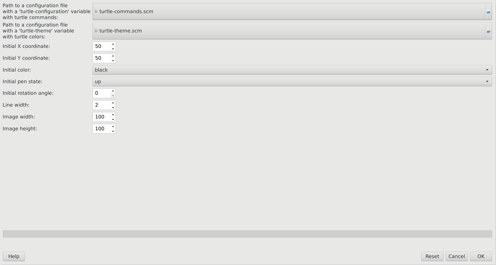

# Turtle

[](https://discuss.pixls.us/t/turtle-for-gimp/44067/4?u=emilygraceseville7cf)

## Description

Script to draw simple drawings.



## Installation

### Linux

- Place `turtle.scm` (referred as a **main script** later) in
  `~/.config/GIMP/2.10/scripts/`.

### Mac OS

This platform is not tested yet, instructions for it may vary.

### Windows

This platform is not tested yet, instructions for it may vary.

## Usage

### Linux

- Create a script `turtle-commands.scm` (referred as a **configuration script**
  later) in `~/.config/GIMP/2.10/scripts/` with
  the following content:

```lisp
; Don't change the variable name
(define turtle-configuration '( ; Don't remove this quote
    ; Turtle commands are placed here
))
```

- Run **main script** via `File > Create > Turtle draw`.
- Select **configuration script** in the opened window.

### Mac OS

This platform is not tested yet, instructions for it may vary.

### Windows

This platform is not tested yet, instructions for it may vary.

## **configuration script** commands

Each command is a list.

| Command  | Description                                             | Arguments                                                                        | Example           |
| -------- | ------------------------------------------------------- | -------------------------------------------------------------------------------- | ----------------- |
| move-on  | Move the turtle on a specific vector                    | `x` (integer) - a unit amount by X axis; `y` (integer) - a unit amount by X axis | `(move-on 30 30)` |
| forward  | Move the turtle forward for a specific amount of units  | `value` (integer) - a unit amount                                                | `(forward 30)`    |
| backward | Move the turtle backward for a specific amount of units | `value` (integer) - a unit amount                                                | `(backward 30)`   |
| left     | Rotate the turtle left at a specific amount of degrees  | `value` (integer) - a degree amount                                              | `(left 90)`       |
| right    | Rotate the turtle right at a specific amount of degrees | `value` (integer) - a degree amount                                              | `(right 90)`      |
| up       | Make turtle not draw on movements                       |                                                                                  |                   |
| down     | Make turtle draw on movements                           |                                                                                  |                   |
| black    | Change the turtle drawing color to black                |                                                                                  |                   |
| red      | Change the turtle drawing color to red                  |                                                                                  |                   |
| green    | Change the turtle drawing color to green                |                                                                                  |                   |
| yellow   | Change the turtle drawing color to yellow               |                                                                                  |                   |
| blue     | Change the turtle drawing color to blue                 |                                                                                  |                   |
| magenta  | Change the turtle drawing color to magenta              |                                                                                  |                   |
| cyan     | Change the turtle drawing color to cyan                 |                                                                                  |                   |
| gray     | Change the turtle drawing color to gray                 |                                                                                  |                   |

## API

All functions starting with `turtle-internal-` are internal functions, all
other ones starting with `turtle-` are free to be used.

## Hints

- Use `(down)` at the beginning of the `turtle-configuration` to make sure
  image is drawn actually.
- Don't set the turtle drawing color before each movement command, it's better
  to set it once for several commands while it's the same.
- Separate logical blocks of commands by one space line, signifying different
  parts of the result image.

## Snippets

### Visual Studio Code

```json
{
    "move": {
        "prefix": "m",
        "description": "[m]ove the turtle for a specific amount of units",
        "body": "(${1|forward,backward|} ${2:units})"
    },
    "rotate": {
        "prefix": "r",
        "description": "[r]otate the turtle at a specific amount of degrees",
        "body": "(${1|left,right|} ${2:degrees})"
    },
    "color": {
        "prefix": "c",
        "description": "Change the turtle drawing [c]olor",
        "body": "(${1|black,red,green,yellow,blue,magenta,cyan,gray|})"
    }
}
```

## Example

Draw a red square 30x30:

```lisp
(define turtle-configuration '(
    (down)
    (red)
    (forward 30)
    (left 90)
    (forward 30)
    (left 90)
    (forward 30)
    (left 90)
    (forward 30)
))
```
